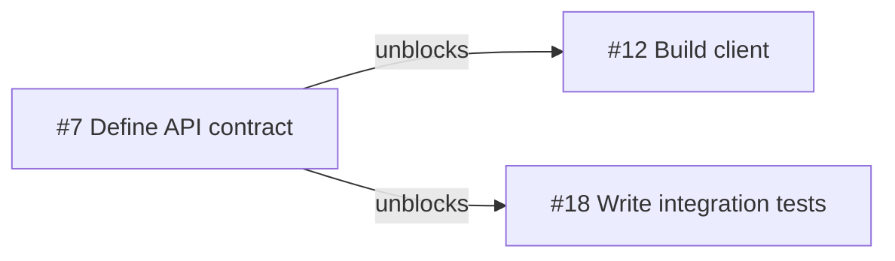

# Hyfa

**Choose work you can start. See what it unlocks.**

Hyfa is a command-line tool for developers and maintainers who plan work in
GitHub Issues. It follows native Issue dependencies to find ready work,
recommend a next step, and explain which Issues that work could unblock.
GitHub remains the source of truth.

When several Issues are ready, look for work that opens up the next steps:



In this example, with no other open blockers, completing #7 makes both #12 and
#18 ready. Hyfa checks all dependencies before counting an Issue as unlocked,
so work with another unresolved blocker stays blocked.

## Get your first recommendation

Download a Linux or macOS binary for x86_64 or ARM64 from
[GitHub Releases](https://github.com/syntropika/hyfa/releases/latest). See the
[installation guide](docs/installation.md) for system requirements and checksum
verification. With Rust 1.94.0 or newer installed, you can also install from crates.io:

```bash
cargo install hyfa --locked --version 0.3.0
```

Sign in through your browser, then replace `OWNER/REPO` with the repository
you want to analyze:

```bash
hyfa auth login
hyfa sync --repo OWNER/REPO
hyfa next --repo OWNER/REPO
```

Hyfa calls GitHub's API directly from Rust. It uses `GH_TOKEN` first, then its
own saved login.
If you already provide `GH_TOKEN`, skip the login command. See
[authentication](docs/installation.md#connect-to-github) for token login and
GitHub Enterprise configuration.
These commands read GitHub without changing remote Issues.

To give a coding agent the Hyfa usage guide, run this from your project:

```bash
hyfa skill install
```

This installs the bundled skill in `.agents/skills/hyfa`. It explains how to
choose ready work, create and update Issues, add comments, and reconcile
pending changes. See [agent setup](docs/installation.md#install-the-agent-skill)
for other providers. The skill is included in the binary and installs offline.

By default, `next` chooses from **unassigned, ready work**. To choose from ready
Issues assigned to a specific person, pass their GitHub login:

```bash
hyfa next --repo OWNER/REPO --assignee LOGIN
```

Use native GitHub Issue dependencies to describe blockers. Optional
`priority:p0` through `priority:p4` labels express your priorities, with P0
highest. See the [usage guide](docs/usage.md) to set up labels and dependencies.

## Understand the choice

`next` compares sequences of up to three executable completions by default. It
considers what becomes ready, the declared priorities of that work, and how
early it unlocks. Each proposed step must be ready and within your selected
assignment scope.

Recommendations include reasons and disclose search limits. The search is
bounded; dependency layers describe structure, not delivery dates. Use
`--horizon 1` for an exact comparison of the eligible first steps.

| What you need | Command |
| --- | --- |
| See everything you can start in your assignment scope | `hyfa ready --repo OWNER/REPO` |
| Choose a next Issue and understand why | `hyfa next --repo OWNER/REPO` |
| See parallel work and dependency layers | `hyfa plan --repo OWNER/REPO` |
| Find cycles, blocked P0 Issues, and priority conflicts | `hyfa triage --repo OWNER/REPO` |

## Keep working offline

After a first successful sync, analysis can fall back to the latest local
snapshot when GitHub is unavailable. Hyfa reports when that snapshot was
synchronized.

You can also create draft Issues and queue edits, comments, and dependency
changes. Pending changes feed into local analysis and remain visibly pending
until accepted by GitHub. Apply queued work explicitly when connectivity
returns:

```bash
hyfa reconcile --repo OWNER/REPO
```

Read commands never replay pending writes. Reconciliation checks current GitHub
state and surfaces conflicts for explicit resolution.

## Explore the graph

Generate a local browser explorer to pan and zoom through a spatial network,
search Issues, and trace blockers and dependents. Switch to dependency layers
or the accessible Issue table when you need another view:

```bash
hyfa graph --repo OWNER/REPO --output site/
```

Open `site/index.html` in your browser. The generated explorer works offline
and includes the recommendation and its supporting analysis. Outcome counts
and a completed-Issue list show finished work alongside what remains open.

For deliberate public sharing, `--public` produces a reduced, script-free view
after checking the repository's current public visibility. See
[public export and GitHub Pages](docs/usage.md)
for its included fields and publication workflow.

## Use Hyfa in scripts and agents

Add `--json` for versioned machine-readable results, including synchronization
time, recommendation evidence, search limits, and pending-change provenance:

```bash
hyfa next --repo OWNER/REPO --json
```

Use the command output as the integration contract. The
[usage guide](docs/usage.md) covers commands, output formats, and conflict
resolution. For development, see [Contributing](CONTRIBUTING.md);
[AGENTS.md](AGENTS.md) provides agent guidance, and
[CONTEXT.md](CONTEXT.md) defines the domain language.
