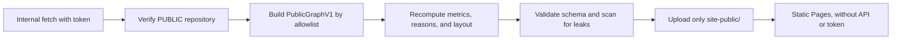

# Public ranking and visualization of the Issue graph

**Status:** research and proposal; the ranking proposal was superseded by ADR 0028  
**Date:** 2026-08-06  
**Assumed scope:** a single GitHub repository per analysis; GitHub Issues and their native dependencies are the source of truth; GitHub Projects is optional.

The factual comparisons and visualization research remain useful. The Pareto and weighted-profile ranking proposal, its Impact/Effort inputs, `score_version`, contributions, and `immediate_ready_delta` schema are historical and not normative. The current `next/v1` contract is defined in `docs/design/ranking-next-v1.md` and adopted by ADR 0028.

## Short answer

Grit should not copy the Beads Viewer ranking as-is. Viewer brings together many valuable ideas—readiness, centrality metrics, cycle detection, parallel plans, and explanations—but its score mixes signals with different semantics and uncalibrated weights. PageRank is efficient and useful for showing structural importance; on its own, it is not a scheduling function, nor does it understand that an Issue may require **all** of its blockers.

The proposal is to separate four questions:

1. **Readiness:** what work can be executed now? It is a constraint, not a compensable component of the score.
2. **Marginal unblocking:** if we finish this Issue, which other Issues actually become ready? This should be the primary structural signal for `grit next`.
3. **Potential impact:** what open work exists downstream, which chains does it support, and what declared value does it have? This helps rank and explain, without calling it work that has already been unblocked.
4. **Graph diagnostics:** PageRank, betweenness, components, cycles, and bottlenecks. They are very useful for `triage`, `insights`, and visualization, but they should not all weigh into `next`.

The static interface is also worth building. The improvement over a simple “cloud” would be to start with an operational summary and use two complementary representations: a layered graph for reading precedences and a network view for exploring components. For Pages, the published artifact must be built from an allowlisted public model and recomputed on that model; hiding fields after analyzing private data is not enough.

## Method and sources

Code and documentation from the following were audited:

- [Beads, commit `8c7db45`](https://github.com/gastownhall/beads/tree/8c7db45c8b1641803c48524aafde3f19a1599b33).
- [Beads Viewer, commit `fba4591`](https://github.com/Dicklesworthstone/beads_viewer/tree/fba4591a4b1553a988a7cf71e631c1fd570b1b32).
- Official GitHub, Sigma.js, and Graphology documentation.
- Original sources for PageRank, betweenness centrality, and Critical Path Method.

In this document:

- **Observed** describes behavior that can be verified in code or documentation.
- **Inference** explains its consequences for Grit.
- **Recommendation** proposes a decision that still needs to be validated with real data.

## What Beads and Beads Viewer contribute

### Beads core

**Observed.** Beads focuses on dependencies, readiness, and coordination. Its graph uses typed relationships and distinguishes blocking links from informational relationships. `bd ready` queries work without open blockers and can combine it with an atomic claim against its local storage. `bd graph` can output terminal, DOT, or HTML. See the [dependency reference](https://github.com/gastownhall/beads/blob/8c7db45c8b1641803c48524aafde3f19a1599b33/docs/CLI_REFERENCE.md#L1780-L1848), the [graph reference](https://github.com/gastownhall/beads/blob/8c7db45c8b1641803c48524aafde3f19a1599b33/docs/CLI_REFERENCE.md#L2032-L2084), and the [ready calculation](https://github.com/gastownhall/beads/blob/8c7db45c8b1641803c48524aafde3f19a1599b33/internal/storage/sqlbuild/ready.go#L47-L125).

No PageRank-like composite ranking equivalent to Viewer's was found in Beads core. What is worth copying is its operational contract: `ready`, `blocked`, unambiguous dependency mutations, graph checks, and a stable representation for automation.

Its multi-repo support materializes or routes data into a local store; it does not turn GitHub into a live-query federated graph. It therefore does not contradict Grit's agreed scope of one repository per analysis.

**Inference.** Grit can resemble Beads in vocabulary and ergonomics without copying JSONL, its database, synchronization, or federation. Nor should it promise `ready --claim`: GitHub does not offer a transaction that jointly checks and updates assignee, state, and Project fields with the same guarantees as Beads' local store.

### Beads Viewer

**Observed.** Viewer builds its analytical graph using only blocking dependencies; stored edges run from the dependent Issue to the prerequisite. On that graph it calculates PageRank, betweenness, depth, slack, components, and cycles. It then produces triage, explained recommendations, and several robot formats. Its [robot workflow](https://github.com/Dicklesworthstone/beads_viewer/blob/fba4591a4b1553a988a7cf71e631c1fd570b1b32/README.md#L174-L285) and [graph export](https://github.com/Dicklesworthstone/beads_viewer/blob/fba4591a4b1553a988a7cf71e631c1fd570b1b32/README.md#L743-L787) are useful references.

Viewer makes good choices that Grit should retain:

- readiness before recommending claimable work;
- explanations and signal breakdowns;
- snapshot hash and status per metric;
- deterministic ordering and structured outputs;
- subgraph filters by root and depth;
- cycles, execution layers, and parallelizable work as distinct concepts.

Its broad `--robot-*` namespace is not worth copying. A global `--json` with versioned schemas is smaller and more coherent.

There are two signs that Grit needs a single source of truth for the analytical contract. Viewer's README still describes a combination of five weights that differs from the eight weights in the current code ([documentation](https://github.com/Dicklesworthstone/beads_viewer/blob/fba4591a4b1553a988a7cf71e631c1fd570b1b32/README.md#L1108-L1123), [implementation](https://github.com/Dicklesworthstone/beads_viewer/blob/fba4591a4b1553a988a7cf71e631c1fd570b1b32/pkg/analysis/priority.go#L53-L72)). It also advertises cycle enumeration, while the current code detects SCCs with Tarjan and retains one representative cycle per component ([documentation](https://github.com/Dicklesworthstone/beads_viewer/blob/fba4591a4b1553a988a7cf71e631c1fd570b1b32/README.md#L460-L470), [implementation](https://github.com/Dicklesworthstone/beads_viewer/blob/fba4591a4b1553a988a7cf71e631c1fd570b1b32/pkg/analysis/graph_cycles.go#L10-L54)). The SCC-bounded behavior is appropriate; what must be avoided is divergence among the schema, help text, and algorithm.

## Audit of Viewer's ranking

### The current score does not represent a single decision

**Observed.** The current base score assigns these weights: PageRank 0.22; betweenness 0.20; number of dependents 0.13; staleness 0.05; priority 0.10; time-to-impact 0.10; urgency 0.10; risk 0.10. Triage then mixes 70% of the base score, 15% unblocking, and 15% quick-win again. See [`priority.go`](https://github.com/Dicklesworthstone/beads_viewer/blob/fba4591a4b1553a988a7cf71e631c1fd570b1b32/pkg/analysis/priority.go#L23-L204) and [`triage.go`](https://github.com/Dicklesworthstone/beads_viewer/blob/fba4591a4b1553a988a7cf71e631c1fd570b1b32/pkg/analysis/triage.go#L1183-L1329).

This mixes at least four distinct things:

- declared value or urgency;
- structural centrality;
- work that would become ready;
- cost, age, and risk.

Several signals count the same topology or age more than once. Moreover, high risk does not have a universal direction: it may justify starting earlier, running a spike first, or avoiding a delivery commitment. An old Issue may be important, but it may also be obsolete or poorly defined. Automatically adding both turns hygiene alerts into execution priority.

**Recommendation.** Keep staleness in a `needs-review` lane and separate `delivery_risk` from urgency. A `priority audit` must be calculated without using the declared priority it is intended to audit; `next` may respect it.

Viewer contains another example of semantic drift: its `quickWins` heuristic calls low fan-out “simplicity,” even though that field counts how many Issues depend on the candidate. It ends up penalizing precisely the impact it is trying to find, without measuring actual effort ([code](https://github.com/Dicklesworthstone/beads_viewer/blob/fba4591a4b1553a988a7cf71e631c1fd570b1b32/pkg/analysis/triage.go#L864-L901)). Grit must derive quick-win from Effort and data coverage, not from the number of dependents.

### Normalization depends too heavily on the observed set

**Observed.** PageRank, betweenness, and fan-out are normalized by dividing by the snapshot maximum. Adding an outlier changes everyone else's effective contribution, even when the relationship among the candidates has not changed. If PageRank times out, Viewer generates uniform values; normalizing them by their maximum gives everyone `PageRankNorm = 1`, making an unavailable metric look like a complete signal. See the [normalization](https://github.com/Dicklesworthstone/beads_viewer/blob/fba4591a4b1553a988a7cf71e631c1fd570b1b32/pkg/analysis/priority.go#L276-L300) and the [PageRank fallback](https://github.com/Dicklesworthstone/beads_viewer/blob/fba4591a4b1553a988a7cf71e631c1fd570b1b32/pkg/analysis/graph.go#L1699-L1733).

**Recommendation.** Use fixed, versioned transformations: explicit mappings for enums, `log1p` with a declared cap for fan-out, known buckets for age and effort, and a tie-break by Issue number. A `timeout`, `skipped`, or `error` metric must remain absent and reduce confidence; it must never silently become a maximum contribution.

### Closed Issues can contaminate the active ranking

**Observed.** `NewAnalyzer` creates nodes and edges for every Issue it receives, without filtering by state. The final score omits closed Issues, but PageRank, betweenness, normalization maxima, and depth have already been calculated on the graph that includes them. The dependent counter even counts duplicates and closed dependents. See [`graph.go`](https://github.com/Dicklesworthstone/beads_viewer/blob/fba4591a4b1553a988a7cf71e631c1fd570b1b32/pkg/analysis/graph.go#L1309-L1367) and [`priority.go`](https://github.com/Dicklesworthstone/beads_viewer/blob/fba4591a4b1553a988a7cf71e631c1fd570b1b32/pkg/analysis/priority.go#L119-L214).

**Recommendation.** The operational graph must contain only open Issues and dependencies that have not yet been satisfied. A closed Issue resolves the state of its edge, but it receives no centrality and does not alter the active ordering. A historical view may include dimmed closed Issues, as a separate graph with separate metrics.

Design invariant: adding or removing an isolated closed Issue—or a fully closed historical chain—cannot reorder active candidates.

### PageRank is efficient, but it does not model AND readiness

**Observed.** The dependent → prerequisite orientation causes PageRank to propagate importance toward blockers; this is reasonable for detecting recursively important foundations. The original algorithm, however, models authority through links and a random surfer, not precedences, duration, or the condition “all these blockers must close.” See the [original paper](https://ilpubs.stanford.edu/422/) and the [PageRank description](https://infolab.stanford.edu/~backrub/google.html#pr).

**Inference.** PageRank may highlight a foundational Issue even when it is not executable or when closing that Issue alone would not make anything ready. This does not make it useless; it makes it a secondary, exploratory signal rather than the primary objective of `next`.

**Recommendation.** Retain PageRank for node sizing, triage, and, optionally, an experimental `recursive-impact` profile. Validate its contribution in shadow mode before giving it weight in the default ranking.

### Betweenness is expensive and its semantics are a poorer fit

**Observed.** Betweenness measures the fraction of shortest paths that pass through a node. In an AND-dependency graph, the shortest path alone does not determine the schedule bottleneck. Exact Brandes costs `O(VE)` on an unweighted graph; an approximation with `k` sources costs approximately `O(k(V+E))`. See the [Brandes paper](https://doi.org/10.1080/0022250X.2001.9990249) and a [sampling method with ε/δ guarantees](https://www.rionda.to/papers/RiondatoKornaropoulos-BetweennessSampling-DMKD.pdf).

Viewer's own benchmark records about 1.26 ms for warm triage on 757 Issues, versus 8.4 s for insights, attributing roughly 7.5 s to exact betweenness and other centrality metrics: [hotspot table](https://github.com/Dicklesworthstone/beads_viewer/blob/fba4591a4b1553a988a7cf71e631c1fd570b1b32/tests/artifacts/perf/HOTSPOT_TABLE.md#L1-L38).

**Recommendation.** Use it as a bridge/bottleneck diagnostic, on demand or approximated with visible seed, sample, and status. It should neither block nor contribute to `next` by default.

### “Critical path” is actually depth when there are no durations

**Observed.** Viewer calculates height by hop count and slack with unit duration; it then mixes that depth with the effort of the individual Issue. This identifies long chains, but it does not implement Critical Path Method using durations across the entire path. See [`computeHeights`](https://github.com/Dicklesworthstone/beads_viewer/blob/fba4591a4b1553a988a7cf71e631c1fd570b1b32/pkg/analysis/graph.go#L2059-L2080), [`computeSlack`](https://github.com/Dicklesworthstone/beads_viewer/blob/fba4591a4b1553a988a7cf71e631c1fd570b1b32/pkg/analysis/graph.go#L2167-L2245), and the [original formulation of CPM](https://doi.org/10.1287/opre.9.3.296).

**Recommendation.** Call the metric `remaining_dependency_depth`. Reserve `critical_path` and `schedule_slack` for when comparable durations and sufficient coverage exist; if durations are imputed, show that with a confidence interval.

### Top-K is not a submodular problem with AND dependencies

**Observed.** Viewer describes its top-K selector as greedy submodular and chooses candidates from all non-closed Issues, not only ready ones. See [`generateTopKSet`](https://github.com/Dicklesworthstone/beads_viewer/blob/fba4591a4b1553a988a7cf71e631c1fd570b1b32/pkg/analysis/advanced_insights.go#L349-L489).

The submodular assumption fails in the minimal case:

```text
A ─┐
   ├──> C
B ─┘

C requires A AND B.
```

If `f(S)` counts newly ready Issues:

```text
Δ(A | ∅)   = 0
Δ(A | {B}) = 1
```

The marginal gain increases after selecting B instead of decreasing. A and B are complements; the greedy `1 - 1/e` guarantee for maximum coverage does not apply here. Moreover, allowing blocked candidates simulates their “magical” closure and may produce a plan that cannot be executed.

**Recommendation.** `plan` must perform a state rollout: choose only from the ready frontier, simulate closure, update blocker counters, and open the next frontier. To search for better combinations, it can use beam search over a small pool or bounded exact enumeration, honestly described as a heuristic. A parallel batch contains only work that is ready at the start; separately, it may explain which combination would enable the next wave.

## Proposed ranking contract for Grit

### 1. Build the operational graph

- Rankable node: open Issue from the repository being analyzed.
- Active edge: `blocked` depends on `blocker`, and the blocker remains open.
- Open or unreadable external blocker: frontier node that affects readiness; it receives neither ranking nor internal centrality.
- Closed, verifiable external blocker: satisfied dependency.
- Cycle: invalid strongly connected component; it is diagnosed, and its members are not candidates for `next`.
- Closed Issues: outside the operational graph and available only in an explicit historical mode.

Separate states should be exposed without collapsing them:

- `issue_state`: GitHub's `OPEN | CLOSED`;
- `project_status`: optional value, if Project is used;
- `dependency_state`: `READY | BLOCKED | CYCLIC | UNKNOWN`;
- `actionable`: sufficient definition and metadata according to policy;
- `available`: unassigned/unreserved, according to the user's filter.

### 2. Apply a gate before scoring

`grit next` considers only open, non-cyclic Issues without open or unknown blockers. A score never compensates for a lack of readiness.

If the product needs it, it must separate:

- `continue`: work already assigned or in progress;
- `next`: new available work;
- `triage`: may highlight an important blocker even if it is not yet executable.

### 3. Calculate signals with verifiable names

| Signal | Question it answers | Recommended use |
|---|---|---|
| `immediate_ready_delta` | How many Issues become ready when this one is completed, accounting for all their co-blockers? | Primary structural signal for `next` |
| `immediate_ready_value` | What declared value does that newly ready work add up to? | Primary if reliable Impact exists |
| `downstream_open_reach` | How many unique open descendants exist downstream? | Potential; deduplicate diamonds |
| `downstream_open_value` | What unique open value depends on it directly or indirectly? | Potential, not immediate unlocks |
| `remaining_dependency_depth` | What is the longest remaining chain in hops? | Structural criticality |
| `critical_path` / `schedule_slack` | Which path dominates the estimated duration? | Only with sufficient duration data |
| `declared_priority`, `impact`, `urgency` | What explicit intent exists? | Respect team policy |
| `effort` | What is its expected cost? | Cost/tie-break; do not pretend cardinality if it is ordinal |
| `definition_confidence` | How reliable is the definition or estimate? | Input data, not algorithm confidence |
| `pagerank` | Which prerequisite receives recursive pressure from the graph? | Secondary/visual insight |
| `betweenness` | Which node connects many shortest paths? | On-demand insight |

“Transitive unblocking” that simulates instantly completing an entire cascade must be called `cascade_potential`, not an immediate unlock count: closing A in `A → B → C` makes B ready, but it does not make C ready yet.

### 4. Make the multicriteria decision visible

There is no primary evidence that a universal set of weights is optimal for Issue scheduling. The formula must be product policy, not a mathematical truth.

Proposal:

1. Strict readiness gate.
2. Show a Pareto tier across a few understandable axes: declared value, unblocking/downstream, urgency/criticality, and lower effort.
3. To return a single result, break ties within the best tier using a weighted, versioned profile.

Possible profiles:

- `balanced`: balances value, unblocking, criticality, and cost;
- `unblock`: favors `immediate_ready_delta/value`;
- `quick-win`: favors value/unblocking for lower effort;
- `critical`: favors explicit urgency and the remaining chain.

No definitive weights are proposed before a corpus and observed outcomes are available. The output must include `score_version`, profile, raw values, transformations, contributions, and reason codes. A difference of `0.731` versus `0.729` must not be presented as objective certainty.

### 5. Handle missing data and confidence without false precision

- Show `data_coverage` and missing fields.
- Do not hide an imputed Effort or Impact as if it were observed.
- When useful, calculate an optimistic/pessimistic range with configured bounds.
- Measure top-result stability under moderate variations in weights and missing data.
- If two intervals overlap or the top result changes easily, report `close_call`.
- Separate team-declared `definition_confidence` from `ranking_confidence`, which describes the calculation's coverage and stability.

## Computational cost

Let `V` be open Issues, `E` active dependencies, `R` ready candidates, `I` PageRank iterations, and `k` approximate betweenness sources.

| Calculation | Time | Comment |
|---|---:|---|
| Graph, readiness, and blocker counters | `O(V+E)` | Basis of every calculation |
| `immediate_ready_delta` for all candidates | `O(V+E)` | Exact via `open_blocker_count` |
| SCCs/cycles, topological order, depth | `O(V+E)` | Do not enumerate all simple cycles |
| CPM/slack on a DAG with durations | `O(V+E)` | After resolving or condensing SCCs |
| PageRank | `O(I(V+E))` | Inexpensive for the usual repository size |
| Exact unweighted betweenness | `O(VE)` | Outside the hot path |
| Sampled betweenness | `O(k(V+E))` | Expose sample, seed, and status |
| Unique reach for each candidate | `O(R(V+E))` naïve | Optimizable with bitsets on a DAG |
| Sort candidates | `O(R log R)` | Negligible compared with fetching |

GitHub paginates Issue and dependency lists; acquisition and caching will probably dominate the linear metrics. The API allows up to 100 items per page, and GitHub documents a limit of 50 dependencies of each type per Issue. See the [dependency API](https://docs.github.com/en/rest/issues/issue-dependencies) and the [dependency announcement](https://github.blog/changelog/2025-08-21-dependencies-on-issues/).

For v1, a deterministic full recompute per snapshot is preferable to introducing incremental state. Cache by hash. Add incremental processing only if benchmarks show that computation, rather than GitHub, is the bottleneck.

## CLI and API for agents

### Recommended surface

```text
grit ready                 # executable set, unordered or with basic ordering
grit next                  # best new executable work
grit triage                # summary, blockers, hygiene, and recommendations
grit plan                  # executable rollout and parallel lanes
grit explain ISSUE         # signals, evidence, and trade-offs
grit block A --by B        # creates a native dependency in GitHub
grit unblock A --by B      # removes a dependency
grit graph --output site/  # HTML + JSON artifact
grit doctor                # auth, permissions, data, and cycles
grit schema
grit capabilities
```

All commands should accept `--json`; there is no need to duplicate them as `--robot-next`, `--robot-plan`, etc. `next` is read-only in v1. A future `start` must declare its race conditions and detect a stale snapshot, not promise Beads' atomic claim.

### JSON envelope

```json
{
  "schema_version": "grit/v1",
  "tool_version": "0.1.0",
  "command": "next",
  "generated_at": "2026-08-06T12:00:00Z",
  "snapshot": {
    "hash": "...",
    "fetched_at": "...",
    "scope": "owner/repo",
    "partial": false
  },
  "analysis": {
    "profile": "balanced",
    "score_version": "v1",
    "metric_status": {}
  },
  "data": {},
  "warnings": []
}
```

Each metric must indicate `computed | approximate | timeout | skipped | error`, as well as duration, reason, and sample where applicable. For each signal, recommendations include: raw value, transformed value, weight, contribution, reason code, and evidence. Ordering and the hash are canonical; `generated_at` is not included in the hash.

An edge is serialized as `{ "blocked": "owner/repo#42", "blocker": "owner/repo#7", "kind": "blocked_by" }`. `source`/`target` alone are ambiguous; the renderer can derive the blocker → blocked arrow.

## Static interface on GitHub Pages

### The interface does add value

A cloud without structure ends up as a hairball. The page should open with operational answers:

- size of the ready frontier and parallel capacity;
- top unblockers with reasons;
- external or unknown blockers;
- cycles and disconnected components;
- long remaining chains;
- Priority/Impact/Effort coverage;
- changes since the previous snapshot, if history is added later.

The graph is the second layer of exploration, not the only product.

### Layout and renderer

Recommendation for v1:

- precompute deterministic positions in the binary;
- condense SCCs and arrange the DAG in topological layers by default;
- offer an optional force-directed view for components;
- use Sigma.js v3 + Graphology: Sigma uses WebGL and is designed for [thousands of nodes and edges](https://www.sigmajs.org/docs/); v4 is still marked alpha;
- optionally run ForceAtlas2 in a Web Worker and use Barnes–Hut where appropriate: [Graphology ForceAtlas2](https://graphology.github.io/standard-library/layout-forceatlas2.html);
- do not calculate in the browser metrics that Grit has already computed.

Cytoscape.js would be a good alternative for modest graphs and rich client-side layouts/algorithms, but its [performance recommendations](https://js.cytoscape.org/#performance) warn about the cost of edges, labels, and styles. For Grit, Sigma requires less duplicate work and scales better as a renderer.

### Minimum interaction

- search by `#n` and title;
- filters by state, priority, area, assignee, and optional Project;
- `root + depth` to isolate a subgraph;
- hover/zoom for labels; do not show every title at once;
- click to open a side panel: readiness, blockers, dependents, score breakdown, and GitHub link;
- highlight upstream, downstream, and the selected path;
- size toggle: unblocking, downstream, or PageRank;
- color toggle: readiness/status or priority;
- accessible table as a fallback and for keyboard navigation.

As an initial guardrail to measure, the full graph can be shown up to approximately 5,000 nodes/20,000 edges; above that, start with an overview and subgraph. This is a UX hypothesis, not an algorithmic limit, and it must be validated with benchmarks in real browsers.

## Public Pages without leaks

GitHub warns that a Pages site may be [publicly available even if its source repository is private](https://docs.github.com/en/pages/getting-started-with-github-pages/configuring-a-publishing-source-for-your-github-pages-site). Grit's assumption should be simpler: every byte of the Pages artifact is public and cacheable.

### Publishing pipeline



Sanitizing **before** public analysis is important. If PageRank, unlock counts, or positions are calculated on private nodes and those nodes are then removed, the remaining metrics may leak their existence or structure.

### Recommended fail-closed policy

- `grit graph --public` checks that the analyzed repository is `PUBLIC`; any unknown visibility causes failure.
- Publish only Issues belonging to that public repository.
- Omit Project data by default; allow it only if the Project is also public and every field is explicitly allowlisted for publication.
- Reject `REDACTED` items, drafts, and edge endpoints that are not in the published graph.
- Represent a private/unreadable external blocker, at most, as an opaque `external_unknown` state, without owner, repository, number, or title.
- A public Project does not make an item whose repository is private public.
- The browser makes no calls to GitHub and never receives credentials.

Reasonable `PublicGraphV1` allowlist:

- `owner/repo#number`, canonical URL, title, state;
- dependencies between published nodes;
- explicitly allowlisted labels;
- typed, named fields that the user authorizes: Priority, Impact, Effort, Confidence, Status;
- metrics, reasons, and positions recomputed on the public graph;
- assignee only through opt-in, even when the repository is public.

Exclude by default:

- body, comments, events, reactions, acceptance criteria, notes, and history;
- emails, internal GraphQL IDs, and raw API payloads;
- drafts, free-text fields, and Project notes;
- names or counts derived from private repositories;
- logs, source maps, debug data, environment variables, and tokens;
- unsanitized Markdown/HTML.

The schema must use `additionalProperties: false`; the build reparses and validates the artifact, restricts URLs, and runs a secret scan as an additional defense. The UI writes text with `textContent`, not `innerHTML`; assets, fonts, and libraries are vendored, with no CDN, analytics, or service worker in v1.

### GitHub Action

Separate build and deploy jobs:

- build has the minimum necessary read permission and produces only `site-public/`;
- deploy needs only `contents: read`, `pages: write`, and `id-token: write`;
- upload `site-public/`, never `.` or the workspace;
- trigger from the default branch, a schedule, or manually, not `pull_request_target` with untrusted content;
- pin actions by SHA and use concurrency so an old deployment does not win the race.

GitHub documents the separate-jobs pattern in [custom workflows for Pages](https://docs.github.com/en/pages/getting-started-with-github-pages/using-custom-workflows-with-github-pages).

## Recommended MVP

### Include

- snapshot of open Issues and native dependencies from one repository;
- readiness, unknown external blockers, and SCC detection;
- `immediate_ready_delta`, unique downstream reach, and remaining depth;
- optional Priority/Impact/Effort and an explainable, versioned score;
- `ready`, `next`, `triage`, `plan`, `explain`, `block/unblock`, `doctor`;
- `--json`, schema, and capabilities from the first version;
- `graph --public` with summary, layered DAG, filters, and side panel;
- PageRank as an insight/visual, not a mandatory `next` signal;
- full recompute and caching by snapshot hash.

### Leave out initially

- Projects as a requirement or canonical source;
- multi-repo/federation;
- JSONL, synchronized local database, and Beads TUI;
- betweenness in the hot path;
- all simple cycles;
- PageRank as a dominant weight;
- atomic claim, forecast, and operational history;
- top-K with a promise of optimality/submodularity;
- publication of private repositories or external items.

## How to validate that the ranking truly improves

### Fixtures and metamorphic tests

Cover at least: chain, fan-out, diamond, `A+B → C`, multiple components, SCC, open/closed/unknown external blocker, missing Effort/Impact, assigned/in-progress Issue, and closed historical chain.

Invariants:

- every `next` output is ready;
- every `plan` step is executable after the preceding steps;
- closing only one of several blockers does not declare the dependent ready;
- closing the last blocker increases `immediate_ready_delta` exactly;
- adding closed history does not change the active ranking;
- adding an irrelevant alternative does not change pairwise scores as a result of normalization;
- increasing Effort does not improve `quick-win`;
- increasing Impact does not worsen its component;
- the explanation reconstructs the score exactly;
- an unavailable metric does not appear as evidence;
- ties, JSON, and snapshot hash are deterministic;
- the actual value falls within the declared interval for missing data.

### Benchmarks

Test synthetic and real snapshots of 100, 1,000, 10,000, and 50,000 open Issues, including diamonds and high fan-out. Measure fetch, construction, ranking, serialization, layout, artifact size, and browser time-to-interactive separately.

### Product validation in shadow mode

Before optimizing weights, compare ablations:

1. declared priority/impact + direct unblocking;
2. previous + downstream/depth;
3. previous + PageRank;
4. previous + betweenness.

Measure:

- observed accuracy of `immediate_ready_delta`;
- blocked Issue-days and time to first unblocking;
- ready-frontier size and parallelism gain;
- acceptance or override of top-1;
- top-k/Kendall stability between snapshots;
- cycle time, distinguishing correlation from causation.

If PageRank or betweenness do not improve outcomes, acceptance, or stability, they remain visualization/diagnostic tools. There is no primary source demonstrating that PageRank is optimal for prioritizing backlogs; that effectiveness must be demonstrated in Grit's domain.

## Decisions this research proposes but does not yet record

1. Exclude closed Issues from the operational graph and offer history as a separate mode.
2. Make readiness a strict gate for `next`.
3. Make `immediate_ready_delta/value` the primary structural signal.
4. Treat downstream, depth, and PageRank as clearly named potential/diagnostic signals.
5. Remove betweenness from the default ranking.
6. Implement `plan` as a ready-only rollout, not greedy submodular selection.
7. Adopt a global, versioned, explainable `--json`, inspired by Beads/Viewer without copying its entire surface.
8. Publish Pages only from a fail-closed, recomputed `PublicGraphV1`.

These proposals need acceptance before being incorporated into `CONTEXT.md` or an ADR.
